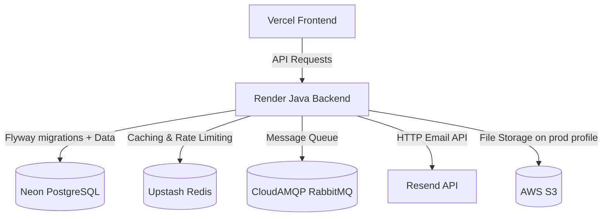
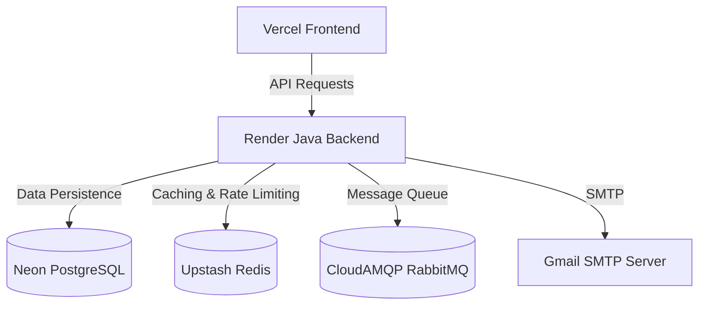

# EmILY Application — Production Deployment Handoff Guide

This document contains a comprehensive blueprint for deploying **EmILY** with the backend on **Render**, the frontend on **Vercel**, and the PostgreSQL database on **Neon**.

> **Last updated**: 2026-06-19  
> **Code quality review**: ✅ All 20 issues resolved (see [`reviews/code_quality_review.md`](file:///d:/Projekt/EmILY/reviews/code_quality_review.md))

---

## 1. Architecture Overview



---

## 2. Database Setup (Neon + Flyway)

The application now uses **Flyway** for database schema management. Hibernate `ddl-auto` is set to `validate` — Flyway owns the schema, not Hibernate.

### Neon Setup
1. Sign up on [Neon.tech](https://neon.tech/) and create a PostgreSQL database.
2. Note your connection details:
   - **JDBC URL**: `jdbc:postgresql://[neon-host]/neondb?sslmode=require`
   - **Username**: `[neon-user]`
   - **Password**: `[neon-password]`

### Flyway Migration Files
Located at `src/main/resources/db/migration/`:

| File | Description |
|------|-------------|
| `V1__initial_schema.sql` | All core tables (users, contacts, email logs, analytics, etc.) |
| `V2__quartz_tables.sql` | Quartz scheduler tables |
| `R__seed_data.sql` | Repeatable seed for the admin user (uses env vars `ADMIN_EMAIL` / `ADMIN_PASSWORD`) |

On first deploy to a fresh Neon database, Flyway will run all migrations automatically at startup. **No manual DDL is needed.**

---

## 3. Support Services Setup (Free Tiers)

### A. Redis (Upstash)
- Create a free Redis database on [Upstash](https://upstash.com/).
- Enable TLS (SSL) in your Upstash configuration.
- Save the **Host**, **Port**, and **Password**.
- Used for: contact list caching (`@Cacheable`) and API rate limiting (Bucket4j).

### B. RabbitMQ (CloudAMQP)
- Create a new instance on the **Little Lemur** (Free) plan on [CloudAMQP](https://www.cloudamqp.com/).
- Save the **Host**, **Username**, and **Password**.
- Used for: async email queuing.

### C. Resend (Email Delivery)
- Sign up at [Resend.com](https://resend.com/) and obtain an API key.
- Verify your sending domain.
- Used for: all outbound email (replaces SMTP to avoid Render's port-block on 587/465).

---

## 4. Backend Deployment (Render)

Render uses the project's root `Dockerfile` to build and deploy the container.

1. Create a **Web Service** on Render pointing to your Git repository.
2. Choose **Docker** as the Runtime environment.
3. Set **Health Check Path** to `/actuator/health` (the root `/` requires auth).
4. Configure the following environment variables:

### Required Environment Variables

| Variable | Value / Purpose |
|---|---|
| `spring.datasource.url` | `jdbc:postgresql://[neon-host]/neondb?sslmode=require` |
| `DB_USERNAME` | Neon DB username |
| `DB_PASSWORD` | Neon DB password |
| `REDIS_HOST` | Upstash Redis hostname |
| `REDIS_PORT` | Upstash Redis port |
| `spring.data.redis.password` | Upstash Redis password |
| `spring.data.redis.ssl.enabled` | `true` |
| `spring.rabbitmq.host` | CloudAMQP hostname |
| `spring.rabbitmq.port` | `5672` |
| `RABBITMQ_USER` | CloudAMQP username |
| `RABBITMQ_PASSWORD` | CloudAMQP password |
| `spring.rabbitmq.virtual-host` | CloudAMQP virtual host |
| `RESEND` | Resend API key |
| `MAIL_USERNAME` | From-address for emails |
| `APP_CORS_ALLOWED_ORIGINS` | `https://your-frontend.vercel.app` (comma-separated) |
| `APP_ENCRYPTION_KEY` | 32-character hex key |
| `GOOGLE_CLIENT_ID` | Google OAuth Client ID |
| `GOOGLE_CLIENT_SECRET` | Google OAuth Client Secret |
| `GITHUB_CLIENT_ID` | GitHub OAuth Client ID |
| `GITHUB_CLIENT_SECRET` | GitHub OAuth Client Secret |
| `ADMIN_EMAIL` | Seed admin user email |
| `ADMIN_PASSWORD` | Seed admin user password |
| `MANAGEMENT_HEALTH_MAIL_ENABLED` | `false` (bypasses Render SMTP health check firewall) |

### Optional — S3 File Storage (prod profile only)
S3 is only active when `SPRING_PROFILES_ACTIVE=prod`. If you enable it, also set:

| Variable | Value |
|---|---|
| `APP_STORAGE_S3_BUCKET_NAME` | Your S3 bucket name |
| `APP_STORAGE_S3_REGION` | e.g. `us-east-1` |
| `AWS_ACCESS_KEY_ID` | Prefer IAM role/instance profile; only needed for local prod testing |
| `AWS_SECRET_ACCESS_KEY` | Same as above |

> See [`.env.example`](file:///d:/Projekt/EmILY/.env.example) for the full template of all variables.

---

## 5. Frontend Deployment (Vercel)

1. Create a new project on Vercel pointing to the `frontend/` directory.
2. Set the following environment variables:

| Variable | Value |
|---|---|
| `NEXT_PUBLIC_BACKEND_URL` | `https://your-render-service.onrender.com` |
| `NEXT_PUBLIC_MOCK` | `false` (or omit — defaults off in production) |

3. Deploy the project.

> **Note**: `NEXT_PUBLIC_MOCK=true` activates the mock API adapter for local development. The condition in [`frontend/lib/api.ts`](file:///d:/Projekt/EmILY/frontend/lib/api.ts) was fixed — it was previously inverted.

---

## 6. OAuth Developer Console Settings

Configure redirect URIs in your provider dashboards to point to the **backend** domain:

- **Google Developer Console**
  - Authorized Redirect URI: `https://your-render-service.onrender.com/login/oauth2/code/google`
- **GitHub Settings**
  - Authorization Callback URL: `https://your-render-service.onrender.com/login/oauth2/code/github`

---

## 7. Code Changes Made for Production Readiness

### 7.1 Database & Testing
- **Flyway migrations**: Replaced Hibernate `ddl-auto=update` with versioned SQL migrations in `src/main/resources/db/migration/`. Schema changes must now go through migration files.
- **Testcontainers**: Switched integration tests from H2 (in-memory) to PostgreSQL via Testcontainers. All tests now run against a real Postgres engine. Shared base class: [`AbstractIntegrationTest.java`](file:///d:/Projekt/EmILY/src/test/java/com/em/emily/AbstractIntegrationTest.java).

### 7.2 Security
- **`.env` credentials cleared**: The `.env` file was overwritten with placeholders. All previously committed secrets must be rotated (see checklist below).
- **TRACE security logging removed**: Removed 4 `TRACE`/`DEBUG` Spring Security logging lines from the default `application.properties`. Tokens and headers are no longer leaked into production logs.
- **`.env.example`** created as a canonical reference for all required environment variables.

### 7.3 Backend Fixes
- **`AnalyticsService`**: Extracted private `buildStats()` helper — eliminates ~80 lines of duplicated rate-calculation logic between `getStats()` and `getStatsForContact()`.
- **`EmailService`**: Consolidated `sendEmailWithAttachments` and `sendEmailWithFileSystemAttachments` — eliminates ~60 lines of near-duplicate attachment handling code.
- **`EmailController`**: Removed orphaned `RabbitTemplate` injection that was never called.
- **`RateLimitingService`**: Extracted `buildConfiguration(BucketType)` helper — `BucketConfiguration` builder is no longer duplicated between the Redis and in-memory fallback paths.
- **`ContactService`**: Added `@Cacheable("contacts")` — Redis cache infrastructure is now actively used.
- **`ResetPasswordServiceImpl.java`**: Deprecated (empty stub; real logic lives in `ResetPasswordService.java`).

### 7.4 Frontend Fixes
- **Mock adapter condition** (`frontend/lib/api.ts`): Fixed inverted guard — was `=== 'false'`, corrected to `=== 'true'`.
- **`showSuccess()` utility** (`frontend/lib/utils.ts`): Replaced silent `console.log` with `toast.success()` from `react-hot-toast`. 24 call sites across contacts, campaigns, templates, and settings pages now show visible user feedback.
- **Dashboard `page.tsx`**: Removed independent `analyticsService.getStats()` call. Dashboard now consumes the `useAnalytics()` context, eliminating a duplicate network request on every page load.
- **`PerformanceChart`**: Timeframe selector now filters chart data client-side (7d / 30d / 90d / all). Previously the selector had no effect.
- **`LiveSystemLogs`**: Removed from analytics page (component rendered hardcoded fake log entries).
- **Dead code deprecated**: `userService.ts`, `use-mobile.ts`, unused `Card` imports in `contacts/page.tsx` and `campaigns/page.tsx`.

### 7.5 Deployment & Config
- **`build.log` / `build_core.log`**: `*.log` added to `.gitignore`; log file contents cleared.
- **`text.exe`**: File cleared; `*.exe` added to `.gitignore`.

---

## 8. Post-Deployment Checklist

### 🔑 Credential Rotation (Critical — Do Before First Deploy)
All of the following were previously committed to `.env` and must be treated as compromised:
- [ ] PostgreSQL password (Neon)
- [ ] Redis password (Upstash)
- [ ] RabbitMQ password (CloudAMQP)
- [ ] GitHub OAuth client secret
- [ ] Google OAuth client secret
- [ ] Resend API key
- [ ] Admin seed password

### 🧹 Git History Cleanup
```bash
git rm --cached .env build.log build_core.log text.exe
git commit -m "chore: untrack secrets, logs, and binary artifacts"
```

### 📦 Remove Unused Frontend Dependencies
```bash
cd frontend && npm uninstall @tailwindcss/typography firebase-tools
```

### ✅ Verify on First Deploy
- [ ] Flyway migration log shows `V1`, `V2`, and `R__seed_data` applied successfully
- [ ] Admin user created with seeded credentials
- [ ] `/actuator/health` returns `{"status":"UP"}`
- [ ] OAuth login works for Google and GitHub
- [ ] Email send creates a log entry and delivers via Resend
- [ ] `@Cacheable` contacts endpoint returns from Redis on second request
- [ ] Rate limiter returns `429` after limit is exceeded

---

## 9. SMTP vs. HTTP Email Delivery

Since Render blocks outbound SMTP by default, the application uses **Resend's HTTP API** for all email delivery. This avoids port 587/465 blocks entirely — all email traffic goes over HTTPS (port 443).

The current [`EmailService.java`](file:///d:/Projekt/EmILY/src/main/java/com/em/emily/email/service/EmailService.java) uses Spring's `JavaMailSender` configured against the Resend SMTP relay endpoint. To migrate fully to Resend's REST API (recommended for reliability), replace `JavaMailSender` with a `RestClient` call:

```java
restClient.post()
    .uri("https://api.resend.com/emails")
    .header("Authorization", "Bearer " + apiKey)
    .contentType(MediaType.APPLICATION_JSON)
    .body(Map.of(
        "from", fromEmail,
        "to", recipient,
        "subject", subject,
        "html", instrumentedBody
    ))
    .retrieve()
    .toBodilessEntity();
```

This is optional if the current SMTP-over-Resend setup is working.


---

## 1. Architecture Overview



---

## 2. Neon Database Setup

1. Sign up on [Neon.tech](https://neon.tech/) and create a PostgreSQL database.
2. Note your connection details. For Spring Boot, format your PostgreSQL connection string into a standard JDBC URL:
   * **JDBC URL**: `jdbc:postgresql://[neon-host]/neondb?sslmode=require`
   * **Username**: `[neon-user]`
   * **Password**: `[neon-password]`

---

## 3. Support Services Setup (Free Tiers)

Your Spring Boot application requires **Redis** (for caching & rate limiting) and **RabbitMQ** (for the email queues).

### A. Redis (Upstash)
* Create a free Redis database on [Upstash](https://upstash.com/).
* Enable TLS (SSL) in your Upstash configuration.
* Save the **Host**, **Port**, and **Password**.

### B. RabbitMQ (CloudAMQP)
* Create a new instance on the **Little Lemur** (Free) plan on [CloudAMQP](https://www.cloudamqp.com/).
* Save the **Host**, **Username**, and **Password**.

---

## 4. Backend Deployment (Render)

Render uses the project's root `Dockerfile` to build and deploy the container on **Java 25**.

1. Create a **Web Service** on Render pointing to your Git repository.
2. Choose **Docker** as the Runtime environment.
3. Under **Advanced Settings**, configure the following environment variables:

| Environment Variable | Recommended Value / Purpose |
| :--- | :--- |
| `spring.datasource.url` | `jdbc:postgresql://[neon-host]/neondb?sslmode=require` |
| `DB_USERNAME` | Neon DB Username |
| `DB_PASSWORD` | Neon DB Password |
| `REDIS_HOST` | Upstash Redis Hostname |
| `REDIS_PORT` | Upstash Redis Port |
| `spring.data.redis.password` | Upstash Redis Password |
| `spring.data.redis.ssl.enabled` | `true` (Enables secure connection to Upstash) |
| `RABBITMQ_USER` | CloudAMQP Username |
| `RABBITMQ_PASSWORD` | CloudAMQP Password |
| `spring.rabbitmq.host` | CloudAMQP Hostname |
| `spring.rabbitmq.port` | `5672` |
| `APP_CORS_ALLOWED_ORIGINS` | `http://localhost:3001,https://base-link-two.vercel.app` (Comma-separated allowed origins) |
| `MAIL_USERNAME` | Your Google/SMTP email address |
| `MAIL_PASSWORD` | Your Google App Password |
| `MANAGEMENT_HEALTH_MAIL_ENABLED`| `false` (Bypasses Render's firewall-blocked SMTP health checks) |
| `APP_ENCRYPTION_KEY` | 32-character hexadecimal key (e.g., `f1a2b3c4d5e6f7a8b9c0d1e2f3a4b5c6`) |
| `GOOGLE_CLIENT_ID` | Google OAuth Client ID |
| `GOOGLE_CLIENT_SECRET` | Google OAuth Client Secret |
| `GITHUB_CLIENT_ID` | GitHub OAuth Client ID |
| `GITHUB_CLIENT_SECRET` | GitHub OAuth Client Secret |

4. Configure the **Health Check Path**:
   * Change the default Health Check Path from `/` to `/actuator/health`. This ensures the deployment is marked as healthy since `/` requires authentication.

---

## 5. Frontend Deployment (Vercel)

1. Create a new project on Vercel pointing to the `frontend` directory of your repository.
2. In the **Environment Variables** section, configure:
   * **Key**: `NEXT_PUBLIC_BACKEND_URL`
   - **Value**: `https://baselink-ru5y.onrender.com` (Your Render Backend URL)
3. Deploy the project.

---

## 6. OAuth Developer Console Settings

To make social logins work, set up the redirect URLs in your provider dashboards to point to the backend domain:

* **Google Developer Console**:
  * Authorized Redirect URI: `https://baselink-ru5y.onrender.com/login/oauth2/code/google`
* **GitHub Settings**:
  * Authorization Callback URL: `https://baselink-ru5y.onrender.com/login/oauth2/code/github`

---

## 7. Key Code Fixes Done For Deployment

To facilitate this production deployment, the following changes were applied directly to the codebase:

1. **Dynamic CORS configuration ([WebConfig.java](file:///d:/Projekt/EmILY/src/main/java/com/em/emily/auth/config/WebConfig.java))**:
   * Rewrote the CORS mapping to load allowed origins dynamically from `app.cors.allowed-origins` (which maps to the `APP_CORS_ALLOWED_ORIGINS` environment variable).
2. **OAuth Popup Origin Whitelisting ([page.tsx](file:///d:/Projekt/EmILY/frontend/app/auth/login/page.tsx))**:
   * Added `onrender.com` to the frontend's listener logic so it listens to successful authentication messages sent from the Render backend.
3. **Public Static Endpoints ([SecurityConfig.java](file:///d:/Projekt/EmILY/src/main/java/com/em/emily/auth/config/SecurityConfig.java))**:
   * Added static assets and favicon routes to `.permitAll()` to avoid false-alarm security warnings.

---

## 8. Switching from SMTP to HTTP for Email Delivery (Recommended)

Since Render blocks outbound SMTP by default, a reliable alternative to requesting an unblock is to migrate your [EmailService.java](file:///d:/Projekt/EmILY/src/main/java/com/em/emily/email/service/EmailService.java) to use an HTTP-based email delivery service (like **Resend** or **SendGrid**).

This avoids SMTP port blocks entirely because all emails are dispatched via standard HTTP API requests (over Port 443).

### Step-by-Step Migration Example (using Resend API)

#### 1. Add dependency for HTTP client
If you don't already have a JSON library or HTTP utility, Spring Boot's built-in `RestClient` (introduced in Spring Boot 3) or `RestTemplate` is sufficient.

#### 2. Configure Environment Variables on Render
Add these variables to Render instead of the `spring.mail` SMTP settings:
* `RESEND_API_KEY`: *your_resend_api_key*
* `EMAIL_FROM`: *noreply@yourverifieddomain.com*

#### 3. Update application.properties
Configure the properties to map to the new variables:
```properties
app.email.api-key=${RESEND_API_KEY}
app.email.from=${EMAIL_FROM}
```

#### 4. Rewrite EmailService to use HTTP RestClient
Update your `EmailService.java` to send HTTP POST requests rather than compiling a `MimeMessage`:

```java
package com.em.emily.email.service;

import org.springframework.beans.factory.annotation.Value;
import org.springframework.web.client.RestClient;
import org.springframework.http.MediaType;
import java.util.Map;
import java.util.List;

@Service
@RequiredArgsConstructor
public class EmailService {

    private final EmailRepository emailRepository;
    
    @Value("${app.email.api-key}")
    private String apiKey;

    @Value("${app.email.from}")
    private String fromEmail;

    private final RestClient restClient = RestClient.create();

    @Async("taskExecutor")
    public void sendEmail(List<String> to, List<String> cc, List<String> bcc, String replyTo, String subject, String body, java.util.UUID userId, Boolean isMarketing) {
        
        for (String recipient : to) {
            // ... (Your existing EmailLog initialization here) ...
            
            try {
                // Send email via Resend HTTP API
                restClient.post()
                    .uri("https://api.resend.com/emails")
                    .header("Authorization", "Bearer " + apiKey)
                    .contentType(MediaType.APPLICATION_JSON)
                    .body(Map.of(
                        "from", fromEmail,
                        "to", recipient,
                        "subject", subject,
                        "html", instrumentEmailBody(body, logEntry.getId(), recipient, isMarketing)
                    ))
                    .retrieve()
                    .toBodilessEntity();

                logEntry.setStatus(EmailStatus.SENT);
                // ... (Publish success event) ...
            } catch (Exception e) {
                logEntry.setStatus(EmailStatus.FAILED);
                logEntry.setErrorMessage(e.getMessage());
            }
            emailRepository.save(logEntry);
        }
    }
}
```
