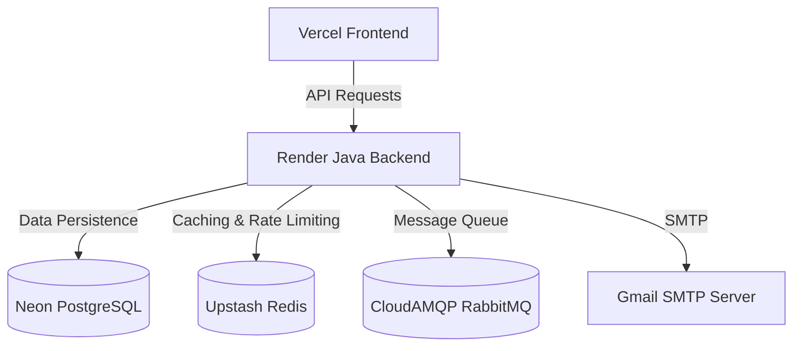

# EmILY Application Production Deployment Handoff Guide

This document contains a comprehensive blueprint for deploying the **EmILY** application with the backend on **Render**, the frontend on **Vercel**, and the PostgreSQL database on **Neon**.

---

## 1. Architecture Overview



---

## 2. Neon Database Setup

1. Sign up on [Neon.tech](https://neon.tech/) and create a PostgreSQL database.
2. Note your connection details. For Spring Boot, format your PostgreSQL connection string into a standard JDBC URL:
   * **JDBC URL**: `jdbc:postgresql://[neon-host]/neondb?sslmode=require`
   * **Username**: `[neon-user]`
   * **Password**: `[neon-password]`

---

## 3. Support Services Setup (Free Tiers)

Your Spring Boot application requires **Redis** (for caching & rate limiting) and **RabbitMQ** (for the email queues).

### A. Redis (Upstash)
* Create a free Redis database on [Upstash](https://upstash.com/).
* Enable TLS (SSL) in your Upstash configuration.
* Save the **Host**, **Port**, and **Password**.

### B. RabbitMQ (CloudAMQP)
* Create a new instance on the **Little Lemur** (Free) plan on [CloudAMQP](https://www.cloudamqp.com/).
* Save the **Host**, **Username**, and **Password**.

---

## 4. Backend Deployment (Render)

Render uses the project's root `Dockerfile` to build and deploy the container on **Java 25**.

1. Create a **Web Service** on Render pointing to your Git repository.
2. Choose **Docker** as the Runtime environment.
3. Under **Advanced Settings**, configure the following environment variables:

| Environment Variable | Recommended Value / Purpose |
| :--- | :--- |
| `spring.datasource.url` | `jdbc:postgresql://[neon-host]/neondb?sslmode=require` |
| `DB_USERNAME` | Neon DB Username |
| `DB_PASSWORD` | Neon DB Password |
| `REDIS_HOST` | Upstash Redis Hostname |
| `REDIS_PORT` | Upstash Redis Port |
| `spring.data.redis.password` | Upstash Redis Password |
| `spring.data.redis.ssl.enabled` | `true` (Enables secure connection to Upstash) |
| `RABBITMQ_USER` | CloudAMQP Username |
| `RABBITMQ_PASSWORD` | CloudAMQP Password |
| `spring.rabbitmq.host` | CloudAMQP Hostname |
| `spring.rabbitmq.port` | `5672` |
| `APP_CORS_ALLOWED_ORIGINS` | `http://localhost:3001,https://base-link-two.vercel.app` (Comma-separated allowed origins) |
| `MAIL_USERNAME` | Your Google/SMTP email address |
| `MAIL_PASSWORD` | Your Google App Password |
| `MANAGEMENT_HEALTH_MAIL_ENABLED`| `false` (Bypasses Render's firewall-blocked SMTP health checks) |
| `APP_ENCRYPTION_KEY` | 32-character hexadecimal key (e.g., `f1a2b3c4d5e6f7a8b9c0d1e2f3a4b5c6`) |
| `GOOGLE_CLIENT_ID` | Google OAuth Client ID |
| `GOOGLE_CLIENT_SECRET` | Google OAuth Client Secret |
| `GITHUB_CLIENT_ID` | GitHub OAuth Client ID |
| `GITHUB_CLIENT_SECRET` | GitHub OAuth Client Secret |

4. Configure the **Health Check Path**:
   * Change the default Health Check Path from `/` to `/actuator/health`. This ensures the deployment is marked as healthy since `/` requires authentication.

---

## 5. Frontend Deployment (Vercel)

1. Create a new project on Vercel pointing to the `frontend` directory of your repository.
2. In the **Environment Variables** section, configure:
   * **Key**: `NEXT_PUBLIC_BACKEND_URL`
   - **Value**: `https://baselink-ru5y.onrender.com` (Your Render Backend URL)
3. Deploy the project.

---

## 6. OAuth Developer Console Settings

To make social logins work, set up the redirect URLs in your provider dashboards to point to the backend domain:

* **Google Developer Console**:
  * Authorized Redirect URI: `https://baselink-ru5y.onrender.com/login/oauth2/code/google`
* **GitHub Settings**:
  * Authorization Callback URL: `https://baselink-ru5y.onrender.com/login/oauth2/code/github`

---

## 7. Key Code Fixes Done For Deployment

To facilitate this production deployment, the following changes were applied directly to the codebase:

1. **Dynamic CORS configuration ([WebConfig.java](file:///d:/Projekt/EmILY/src/main/java/com/em/emily/auth/config/WebConfig.java))**:
   * Rewrote the CORS mapping to load allowed origins dynamically from `app.cors.allowed-origins` (which maps to the `APP_CORS_ALLOWED_ORIGINS` environment variable).
2. **OAuth Popup Origin Whitelisting ([page.tsx](file:///d:/Projekt/EmILY/frontend/app/auth/login/page.tsx))**:
   * Added `onrender.com` to the frontend's listener logic so it listens to successful authentication messages sent from the Render backend.
3. **Public Static Endpoints ([SecurityConfig.java](file:///d:/Projekt/EmILY/src/main/java/com/em/emily/auth/config/SecurityConfig.java))**:
   * Added static assets and favicon routes to `.permitAll()` to avoid false-alarm security warnings.

---

## 8. Switching from SMTP to HTTP for Email Delivery (Recommended)

Since Render blocks outbound SMTP by default, a reliable alternative to requesting an unblock is to migrate your [EmailService.java](file:///d:/Projekt/EmILY/src/main/java/com/em/emily/email/service/EmailService.java) to use an HTTP-based email delivery service (like **Resend** or **SendGrid**).

This avoids SMTP port blocks entirely because all emails are dispatched via standard HTTP API requests (over Port 443).

### Step-by-Step Migration Example (using Resend API)

#### 1. Add dependency for HTTP client
If you don't already have a JSON library or HTTP utility, Spring Boot's built-in `RestClient` (introduced in Spring Boot 3) or `RestTemplate` is sufficient.

#### 2. Configure Environment Variables on Render
Add these variables to Render instead of the `spring.mail` SMTP settings:
* `RESEND_API_KEY`: *your_resend_api_key*
* `EMAIL_FROM`: *noreply@yourverifieddomain.com*

#### 3. Update application.properties
Configure the properties to map to the new variables:
```properties
app.email.api-key=${RESEND_API_KEY}
app.email.from=${EMAIL_FROM}
```

#### 4. Rewrite EmailService to use HTTP RestClient
Update your `EmailService.java` to send HTTP POST requests rather than compiling a `MimeMessage`:

```java
package com.em.emily.email.service;

import org.springframework.beans.factory.annotation.Value;
import org.springframework.web.client.RestClient;
import org.springframework.http.MediaType;
import java.util.Map;
import java.util.List;

@Service
@RequiredArgsConstructor
public class EmailService {

    private final EmailRepository emailRepository;
    
    @Value("${app.email.api-key}")
    private String apiKey;

    @Value("${app.email.from}")
    private String fromEmail;

    private final RestClient restClient = RestClient.create();

    @Async("taskExecutor")
    public void sendEmail(List<String> to, List<String> cc, List<String> bcc, String replyTo, String subject, String body, java.util.UUID userId, Boolean isMarketing) {
        
        for (String recipient : to) {
            // ... (Your existing EmailLog initialization here) ...
            
            try {
                // Send email via Resend HTTP API
                restClient.post()
                    .uri("https://api.resend.com/emails")
                    .header("Authorization", "Bearer " + apiKey)
                    .contentType(MediaType.APPLICATION_JSON)
                    .body(Map.of(
                        "from", fromEmail,
                        "to", recipient,
                        "subject", subject,
                        "html", instrumentEmailBody(body, logEntry.getId(), recipient, isMarketing)
                    ))
                    .retrieve()
                    .toBodilessEntity();

                logEntry.setStatus(EmailStatus.SENT);
                // ... (Publish success event) ...
            } catch (Exception e) {
                logEntry.setStatus(EmailStatus.FAILED);
                logEntry.setErrorMessage(e.getMessage());
            }
            emailRepository.save(logEntry);
        }
    }
}
```
